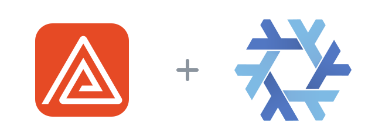

<p align="center">
  
</p>

<p align="center">
  <a href="https://delta.dev"></a>
  <a href="https://nixos.org"></a>
  <a href="LICENSE"></a>
</p>

# Delta for Nix

A Nix flake for the Linux build of [Delta](https://delta.dev), Zed's multiplayer environment for coding with agents and reviewing their work.

It packages the official binary archive, installs its desktop entry and icons, and exposes both NixOS and Home Manager modules. Delta itself is account-gated and distributed under Zed's terms, so its archive cannot be downloaded unattended by Nix.

## Install

Download `delta-linux-x86_64.tar.gz` from the [official download page](https://delta.dev/download), then add it to the Nix store:

```console
nix-store --add-fixed sha256 ~/Downloads/delta-linux-x86_64.tar.gz
nix run github:Fractal-Tess/delta-flake
```

For NixOS, add the flake input and module, then enable it:

```nix
{
  inputs.delta-flake.url = "github:Fractal-Tess/delta-flake";

  imports = [ inputs.delta-flake.nixosModules.default ];
  programs.delta.enable = true;
}
```

The same option is available through `homeManagerModules.default`.

## Verify

```console
nix flake check
nix run . -- --version
```

The installed command is `zed-delta`, avoiding a collision with the unrelated `delta` Git diff pager in nixpkgs. The desktop launcher remains named **Delta**.

The Delta mark is from [Zed Industries](https://delta.dev/brand). The Nix snowflake is by Simon Frankau and Tim Cuthbertson under [CC BY 4.0](https://github.com/NixOS/nixos-artwork/blob/master/LICENSE). The marks were resized and arranged; this project is not endorsed by either project.
